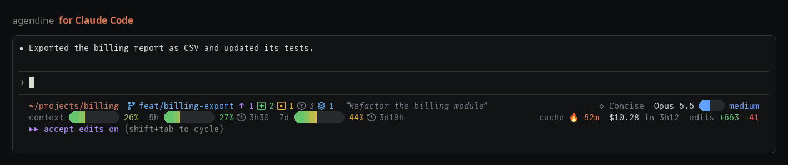

# agentline

A status line for AI coding agents in the terminal: the full version for
**Claude Code**, a matching built-in preset for **Codex**. Two lines by default,
one line or your own arrangement if you prefer, for dark or light terminals. It
also shows how [automodel](#automodel) routes each prompt when you use it.



```
~/projects/billing  ⎇ feat/billing-export ↑1 +2 !1 ?3 $1  “Refactor the billing module”       ◇ Concise  Opus 5.5 ●●○○○ medium
context ██▋        26%  5h ██▋        27% ↻3h30  7d ████▍      44% ↻3d19h         cache 🔥 52m  $10.28 in 3h12  edits +663 −41
```

This is the real renderer's output for the sample session (`lib/sample.json`) in
a 130-column terminal, with `unicode` glyphs (hence `smooth` bars and the `⎇` `↻`
icons) and every other setting at its default (`two` lines, `dots` effort gauge).
Plain text loses the colours and the bar tracks; with a Nerd Font you get icons
and capsule bars, as in the demo.

- **Line 1**: where you are (directory, git branch and status, session name) on the
  left; who answers (output style, model, reasoning effort, automodel's routing) on
  the right.
- **Line 2**: budgets (context window, 5-hour and 7-day limits) on the left; session
  stats (prompt cache, cost and duration, lines edited) on the right. Both right
  blocks line up.

## What it shows

| Segment | Details |
|---|---|
| Directory | In Claude Code's own accent colour. |
| Git | Branch, ahead/behind, then staged, modified, untracked, conflicts, stash (see [Glyphs](#glyphs)). Worktrees get their own icon. Cached 2 s per directory. |
| Model | Claude Code's model, or, when [automodel](#automodel) routes the session, the model it picked: `jev → Opus 5.5`. |
| Effort | 5-step gauge coloured from `low` to `max`, dots `●●○○○` by default (the effort automodel picked, when it routes). **Ultracode** gets its own effect: by default Claude Code's violet with a sweeping highlight; else a drifting rainbow, or plain violet. |
| Route | Only when automodel routes the session: how it decided. The confidence `0.86` (green, yellow, red), or `default`, `pinned`, `⚠ fallback`; `⚠ budget` over automodel's spending cap; `⚠ jev: <why>` when its router could not be asked; `↻ switched` for a moment after it changes its mind. See [the route part](#the-route-part). |
| Context | Gradient bar and percentage; the percentage pulses above 85 %. |
| 5h / 7d | Usage bar and percentage. `⚠ 1h20` in red when the current pace reaches the limit before it resets; otherwise the time until reset. |
| Prompt cache | `🔥 51m` while warm, `⏳ 4m` in the last sixth of its TTL, `🧊 cold` once expired. A cold cache makes the next turn re-read the whole context. |
| Cost, duration, edits | From Claude Code's session counters. |

**Responsive**: every segment has progressively shorter forms. When the terminal
narrows, each line gives up the least useful detail first (session name, edits,
routing details, labels), then bars turn into compact gauges, then the branch name
is truncated. It stays readable down to about 60 columns, and the width comes from
the terminal Claude Code runs in.

**Animation**: Claude Code re-renders a status line at most once per second
(`refreshInterval` cannot go below 1), so the ultracode effects are designed for one
frame per second: a fine gradient that drifts a little each second instead of
jumping.

**Fast**: one `jq` call per render and cached git and terminal lookups: a few tens
of milliseconds, so the 1-second refresh the installer sets (needed for the
animations) is cheap. automodel, when present, is asked while the rest renders.

## Install

Needs bash 5, `jq`, `git` and `curl`, on Linux or macOS (there: `brew install bash
jq`); see [Requirements](#requirements-and-compatibility).

```sh
curl -fsSL https://raw.githubusercontent.com/moukrea/agentline/main/install.sh | bash
```

This installs the latest release, never unreleased code from `main`.

The first install opens a full-screen setup assistant. At the top, a live preview:
the real status line, drawn from your last Claude Code session (a sample one on a
fresh machine) in the directory you run it from, with its real git state (simulated
outside a repository), at your terminal's exact width. The session is read once, so
only the animations move. It re-renders on every change, every
second (animations run) and when you resize the window, so you see the responsive
layout at work. "Preview as" switches the preview to ultracode, near-the-limits, a
cold prompt cache or a session routed by automodel; the preview also narrows itself
while you pick compact gauges, shows ultracode while you pick its effect and
automodel's routing while you are on its settings. Defaults are Nerd icons and
capsule bars when a Nerd Font is installed, Unicode otherwise, with a link to the
font guide. Below, with ↑↓ ←→ and space:

- glyphs, theme (dark or light background), layout (two lines, one line, or a
  custom one kept from your config), progress bars, compact gauges (narrow
  terminals), effort gauge, ultracode effect, branch and reset icons, automatic
  updates;
- which parts Claude Code shows (directory, git, session name, model, effort,
  automodel's routing details, context, limits, cache, cost, edits…);
- automodel routing on or off, with a line saying whether automodel was found;
- for Codex, "Mirror Claude Code" (on by default) ticks the Codex items closest to
  the parts shown on the Claude Code side; the item list folds out to pick by hand.

Enter saves and installs for Claude Code and Codex, whichever are on the machine.

Non-interactive (CI, dotfiles), with options passed through `bash -s --`:

```sh
curl -fsSL https://raw.githubusercontent.com/moukrea/agentline/main/install.sh \
  | bash -s -- --yes --glyphs nerd --bar capsule --theme dark --layout two
```

From a clone, `./install.sh` does the same. `./install.sh --help` (or
`agentline install --help`) lists every option.

The installer is idempotent: run it again at any time, it only rewrites what
differs. It backs up each file it edits once (`settings.json.agentline-backup`,
`config.toml.agentline-backup`) and keeps any status line you had configured, so
uninstalling puts it back.

### Pin a version, or read it first

A given release:

```sh
curl -fsSL https://raw.githubusercontent.com/moukrea/agentline/v0.5.0/install.sh \
  | AGENTLINE_REF=v0.5.0 bash
```

Turn automatic updates off (in the assistant, or `agentline install --auto-update
off`) to stay on it. `AGENTLINE_REF` works for `agentline update --force` too, to
go back to a release.

To read the code before running it, clone the release and run its installer: it
installs that copy and downloads nothing.

```sh
git clone --depth 1 --branch v0.5.0 https://github.com/moukrea/agentline
cd agentline
less install.sh claude/statusline.sh   # the installer, and what Claude Code runs
./install.sh
```

### The `agentline` command

Installed in `~/.local/bin`:

```sh
agentline configure              # run the assistant again
agentline install --theme light  # change options without the assistant (--help: all of them)
agentline update                 # install the latest release if newer
agentline uninstall              # restore the previous status lines
agentline uninstall --purge      # and delete ~/.config/agentline
agentline version
```

### Updates

With automatic updates on (the assistant's default), the status line checks for a
new release at most once a day, in the background: rendering never waits for it.
Updates only ever install a published release, and download nothing when you
already have the latest one. Your configuration is kept across updates. Turn them
off with `agentline install --auto-update off`, or update by hand with
`agentline update`. See [CHANGELOG.md](CHANGELOG.md) for what changed.

## Requirements and compatibility

- **Linux or macOS**, with **bash 5**, `jq`, `git` and `curl` (and `ps`, `stty`
  for the terminal's width). macOS ships bash 3.2: `brew install bash jq`. The
  installer runs itself with the first bash 5 it finds (Homebrew, Linuxbrew,
  MacPorts, then your `PATH`) and writes that bash's absolute path in Claude
  Code's `statusLine`, so an older bash first in Claude Code's `PATH` is never
  used. Python 3.11, when present, checks that an edited Codex `config.toml` still
  parses.
- **Claude Code**: agentline reads these fields of the JSON Claude Code sends to
  status lines: `cwd` and `workspace` (directory, project, worktree), `model`,
  `effort.level`, `session_id`, `session_name`, `transcript_path`, `output_style`,
  `agent`, `vim.mode`, `fast_mode`, `context_window`, `cost`, `rate_limits` and
  `prompt_cache`. A field your Claude Code version or plan does not send just
  hides its part.
- **Codex**: Codex draws its own line from `tui.status_line` in
  `~/.codex/config.toml`; agentline only picks the items (see [Codex](#codex)).
- `CLAUDE_CONFIG_DIR`, `CODEX_HOME`, `XDG_CONFIG_HOME` and `XDG_DATA_HOME` are
  honoured. The `agentline` command goes to `~/.local/bin` (`AGENTLINE_BIN_DIR`).

## Fonts

**Recommended: [JuliaMono](https://github.com/cormullion/juliamono), with
[Symbols Nerd Font Mono](https://github.com/ryanoasis/nerd-fonts) as fallback.**
JuliaMono is the only free monospace font that draws every symbol Claude Code uses;
the Nerd symbols provide the icons. Both are free for any use (SIL OFL 1.1, MIT).

The installer uses Nerd icons and capsule bars when it finds a Nerd Font on the
machine, and Unicode glyphs otherwise. Installation per system and terminal
settings: **[docs/fonts.md](docs/fonts.md)**.

## Configuration

`~/.config/agentline/config`, written by the installer and read on every render.
Environment variables with the same names override it. Every setting also has an
installer option (`agentline install --help`).

The three gauges (bars, compact gauges, effort) share one catalogue of styles:
`capsule` (rounded ends, Nerd), `smooth` (eighth-cell bar on a solid rail), `blocks`
`█▒░`, `line` `━╸─`, `segments` `■□`, `braille` `⣿⣀`, `ramp` `▁▂▄▆█`, `dots` `●○`,
`bars` `▰▱`, `squares` `■□`, `pie` (a single circle slice) and `none` (value only).

| Variable | Values | Default |
|---|---|---|
| `AGENTLINE_GLYPHS` | `nerd`, `unicode` | `nerd` when a Nerd Font is installed, else `unicode` |
| `AGENTLINE_THEME` | `dark`, `light`: the terminal's background. `light` uses dark text and labels, a lighter bar track and darker greens, yellows and blues. | `dark` |
| `AGENTLINE_LAYOUT` | `two`, `one`, or a custom spec (see [Layouts](#layouts)) | `two` |
| `AGENTLINE_BAR` | context, 5h and 7d bars: any style | `capsule` with Nerd glyphs, else `smooth` |
| `AGENTLINE_COMPACT_STYLE` | gauges when the terminal is too narrow for bars: any style | `pie` |
| `AGENTLINE_EFFORT_STYLE` | effort gauge: any style, or `auto` (same as the bars) | `dots` |
| `AGENTLINE_ULTRA_EFFECT` | `rainbow` (drifting gradient), `violet` (Claude Code's ultracode violet with a sweeping highlight), `plain` (static violet); applies to the effort part only | `violet` |
| `AGENTLINE_BRANCH_ICON` | `auto`, `unicode` `⎇`, `octicon`, `powerline`, `devicon` | `auto` |
| `AGENTLINE_RESET_ICON` | `auto`, `unicode` `↻`, `octicon` (history), `mdi-history`, `mdi-progress-clock`, `mdi-refresh` | `auto` |
| `AGENTLINE_SEGMENTS` | shown parts: `dir git session meta model effort route ctx 5h 7d cache cost lines` | all |
| `AGENTLINE_AUTOMODEL` | `auto`: show automodel's routing when it routes the session; `off`: never ask automodel (see [automodel](#automodel)) | `auto` |
| `AGENTLINE_CODEX_MIRROR` | `1`: Codex shows the items closest to the Claude Code parts shown; `0`: `AGENTLINE_CODEX_ITEMS` | `1` |
| `AGENTLINE_CODEX_ITEMS` | Codex items, in order (see `codex/preset`) | the preset |
| `AGENTLINE_PATH_COLOR` | `R;G;B` | `215;119;87` (Claude Code's accent) |
| `AGENTLINE_ICON_GAP` | `auto`, `0`, `1`: space after Nerd icons, which are often drawn wider than their cell | `auto` (on with Nerd glyphs) |
| `AGENTLINE_AUTO_UPDATE` | `1`, `0` | `1` |

`auto` icons follow `AGENTLINE_GLYPHS`: octicons with `nerd`, Unicode otherwise.
`capsule` needs Nerd glyphs; with `unicode` it falls back to `smooth`.
`AGENTLINE_CONFIG_VERSION` is the installer's own bookkeeping: leave it as is.

### Layouts

`AGENTLINE_LAYOUT` places the parts on lines. Two presets:

| Layout | Lines |
|---|---|
| `two` (default) | `dir git session \| meta model route` then `ctx 5h 7d \| cache cost lines` |
| `one` | `dir git \| model route ctx 5h 7d cache`, for a single line of status |

Anything else is a custom spec: lines separated by `;`, each one `left | right`
(the right part is optional and is aligned with the right parts of the other
lines). Part names are those of `AGENTLINE_SEGMENTS`; `effort` always goes with
`model`, and unknown names are ignored.

```sh
agentline install --layout "dir git | model route; ctx 5h 7d | cost"
# or in ~/.config/agentline/config:
AGENTLINE_LAYOUT="dir git | model route; ctx 5h 7d | cost"
```

A part must also be in `AGENTLINE_SEGMENTS` to show. Whatever the layout, a line
too wide for the terminal gives up detail in the same order, least useful first
(session name, edits, routing details, labels…), each line on its own. The
assistant keeps a custom layout from your config as "custom (from config)".

### Glyphs

| Git state | `unicode` | `nerd` (octicons) |
|---|---|---|
| staged | `+` | diff-added |
| modified, not staged | `!` | diff-modified |
| untracked | `?` | question |
| conflicts | `=` | alert |
| stash | `$` | stack |
| ahead / behind | `↑` `↓` | arrow-up / arrow-down |
| clean | `✓` | check |

The Unicode set follows [Starship](https://starship.rs)'s conventions.

## automodel

[automodel](https://github.com/moukrea/automodel) lets Claude Code pick the model
and effort of each prompt: you choose **Jev (auto)** in `/model`, and it routes
every prompt to, say, Opus at `xhigh` or Haiku at `low`. Claude Code itself only
knows the session runs on "Jev (auto)" and reports its own effort, so a plain
status line shows the wrong model and effort. agentline asks automodel instead:

```
~/projects/billing  ⎇ main ✓                                   jev → Opus 5.5 ●●●●○ xhigh  0.86 ↻ switched
```

- The **model** part shows `jev → Opus 5.5`: automodel's alias, then the model it
  picked for the last prompt, with **the effort it picked** in the effort gauge.
  When it routes to ultracode, the ultracode effect runs as usual.
- The **route** part (next to the model) shows how it decided, described below.
- Sessions on a model you picked yourself look as usual: no arrow, no route.

### How it is wired

agentline owns Claude Code's `statusLine`; automodel only provides data. On each
render, agentline finds automodel through the `UserPromptSubmit` hook automodel
installs in `settings.json` (`<automodel> --config <config.toml> hook decide`), and
runs `automodel --config <config.toml> statusline --json` with the payload Claude
Code sent. The call runs while the rest of the line renders and is waited for
0.8 s at most; a missing, slow or broken answer just means "not routed": no error,
no broken line. Where automodel lives, and whether it is recent enough, is cached
until `settings.json` or the automodel binary changes, so without automodel a
render costs no extra process.

automodel releases before 0.7.0 (without `statusline --json`) are detected (from `automodel help`)
and never called: update automodel to see its routing.

### Install order

Either order works:

- **automodel first, then agentline**: automodel's installer set its own status
  line; agentline's takes it over (and keeps it aside for `--uninstall`) and says
  that agentline now shows automodel's routing itself.
- **agentline first, then automodel**: automodel's installer sees a status line
  whose command contains `agentline` and leaves it in place (`automodel doctor`
  reports "agentline shows the automodel segment"); its updates leave it alone too.

Older automodel releases put their own status line back when they update:
run `agentline install` again, and update automodel.

**Uninstalling agentline** while automodel is still installed gives automodel its
own status line back (restored, or recreated from its hook), so you keep seeing
the routing. If you had a status line of your own before agentline, the uninstaller
prints the `statusline_command = "…"` line to add to automodel's `config.toml` so
that automodel shows it before its segment. **Uninstalling automodel** leaves
agentline in place; it simply stops showing routing.

If automodel's own status line runs agentline as its chained `statusline_command`
(it sets `AUTOMODEL_CHAINED=1`), agentline does not ask automodel: automodel
prints its segment itself in that setup.

### The route part

| Shown | Meaning |
|---|---|
| `0.86` | Jev, automodel's router, chose this model and effort with this confidence: green from 0.80, yellow from 0.60, red below. |
| `default` | Before the first decision of the session: automodel's default model and effort. |
| `pinned` | Your `/effort` wins: routing pauses until you set it back to its default. |
| `⚠ fallback` | Jev could not be asked; automodel used its default. |
| `⚠ catalog` | automodel cannot load its model catalog (the model part keeps Claude Code's). |
| `real effort: low (Claude Code shows xhigh)` | automodel runs another effort than the one Claude Code displays (its spinner, `/effort`): per-turn effort over a fixed base keeps the prompt cache. The model part shows the real one. Compact: `(CC: xhigh)`. Needs automodel 0.9.0 or later. |
| `⚠ budget` | The session or the day is over automodel's spending cap (yellow). |
| `⚠ jev: <why>` | Why Jev could not be asked, such as a missing OpenRouter key. |
| `↻ switched`, `↻ compact`, `↻ cold` | For a moment (automodel's `statusline_flash`, 30 s) after a new decision: a model switch, a compaction, a cold prompt cache. |

On narrower terminals the route part shortens to the number or word with a single
`⚠` and `↻`, then to a lone `⚠` when something is wrong, then disappears. Hide it
altogether by leaving `route` out of `AGENTLINE_SEGMENTS`; the model and effort
still follow automodel. `AGENTLINE_AUTOMODEL=off` stops asking automodel: the
session then shows as Claude Code reports it.

`AGENTLINE_AUTOMODEL_JSON` replaces the call with a fixed answer, which is how the
assistant previews and the tests show routing without running automodel;
`'{"v":1,"routed":false}'` shows any session as not routed.

## Codex

Codex has no external status line command: its `tui.status_line` setting is a list
of items Codex draws itself, so custom glyphs, bars, colours, themes and layouts
are not possible there. What you can choose is which items it shows. By default it
mirrors the Claude Code side: model and reasoning, directory, git branch, session
title, context used, 5-hour and weekly limits and estimated cost, minus whatever
you hide in Claude Code (Codex has no counterpart for the route part). Turn
mirroring off to pick items by hand (`AGENTLINE_CODEX_ITEMS`).
`status_line_use_colors = true` is set as well.

The installer only touches the two keys it manages in `[tui]` (tagged
`# agentline`). A `status_line` of yours is commented out, not deleted, and
`--uninstall` puts it back.

## How ultracode is detected

Claude Code reports ultracode to status lines as effort `xhigh`. The real signal is
the `ultra_effort_enter` / `ultra_effort_exit` entry in the session transcript, or
`"ultracode": true` in the settings. The transcript is read incrementally: only the
bytes added since the previous render. In a session automodel routes, its answer
says when it chose ultracode.

## Privacy and network

agentline sends nothing about you or your sessions anywhere: no telemetry. On each
render it reads, locally:

- the JSON Claude Code pipes to it (model, session, cost, limits…);
- the session transcript, only to detect ultracode, and only the bytes added since
  the previous render; the `ultracode` key of Claude Code's `settings.json` files;
- the `git status` of the session's directory, and the terminal's size;
- its config, and, when automodel routes the session, the answer of
  `automodel statusline --json`: a local process (what automodel itself does over
  the network is up to automodel).

It caches git state, the terminal and the last session (for the setup assistant's
preview) in a private directory of yours: `$XDG_RUNTIME_DIR/agentline-<uid>`, else
under `$TMPDIR` or `/tmp`.

The only network access is installing and updating. With automatic updates on, at
most once a day the status line asks github.com for the latest release's tag (the
API at api.github.com if that fails) and, only when there is a new one, downloads
it from codeload.github.com. `agentline update` and the installer do the same;
`agentline install --auto-update off` stops the daily check.

## Troubleshooting

- **Nothing shows up.** Run the command Claude Code runs, with an empty session:
  `eval "$(jq -r .statusLine.command ~/.claude/settings.json)" <<< '{}'` prints a
  short line, or an error naming what is missing. `jq` and `git` must be in the
  `PATH` Claude Code starts with (started from an app or IDE on macOS, it may lack
  Homebrew's `/opt/homebrew/bin`). With `CLAUDE_CONFIG_DIR` set, run the installer
  with the same value. Then restart Claude Code.
- **Wrong width.** The line fits the terminal Claude Code runs in, found through
  its controlling terminal (`ps`, then `stty size`), minus Claude Code's padding.
  `COLUMNS` in Claude Code's environment wins; without it and without a terminal
  (some IDE panes), 120 columns are assumed.
- **Boxes or question marks instead of icons.** Your terminal font has no Nerd
  icons: install one ([docs/fonts.md](docs/fonts.md)), or switch to
  `agentline install --glyphs unicode`. `🔥 ⏳ 🧊` come from your emoji font.
- **Slow render.** Time it in the project:
  `time (eval "$(jq -r .statusLine.command ~/.claude/settings.json)" <<< '{}')`
  takes a few tens of milliseconds once its caches are warm (run it twice). A huge
  repository slows `git status` (run at most every 2 s per directory: leave `git`
  out of `--segments`); a slow automodel is waited for 0.8 s at most
  (`--automodel off`). Releases before 0.5.0 were slow on bash 5.3:
  `agentline update`.

## Development

```sh
tests/run.sh    # renders every fixture × glyph set × bar style at 17 widths, the
                # layouts, the light theme and automodel's answers (with a fake
                # automodel); installs, reinstalls, migrates, updates (from a fake
                # GitHub) and uninstalls in a throwaway HOME, including a simulated
                # `curl | bash` with scripted assistant answers and install over
                # automodel's status line
```

CI runs ShellCheck (`install.sh`, `claude/statusline.sh`, `lib/wizard.sh`,
`bin/agentline`, `tests/run.sh`) and the suite on pushes to `main`, on tags and on
pull requests.

`docs/demo.gif` is recorded from the real renderer with a pinned clock and sample
session: `tools/record-demo.py [--fonts DIR] [--emoji-font FILE]` (JuliaMono and
Symbols Nerd Font Mono files in DIR, `~/.local/share/fonts` by default; needs
Pillow, ffmpeg, jq and Noto Sans). Emoji need the CBDT (bitmap) build of Noto Color
Emoji, which Pillow can draw, unlike the COLRv1 build many systems ship: get
`NotoColorEmoji.ttf` from a [noto-emoji release](https://github.com/googlefonts/noto-emoji/releases)
and pass it with `--emoji-font`. It never runs automodel: the routed scenes pass
their answers in `AGENTLINE_AUTOMODEL_JSON`. Release tarballs leave out the demo,
`tools/`, `tests/` and `.github/` (`.gitattributes`).

## License

MIT
